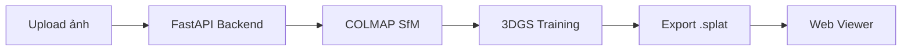

# ImageSplat Studio

Web app tạo **mô hình 3D** từ:
- **Point cloud** → mesh 3D (Open3D Poisson / Ball Pivoting)
- **Bộ ảnh** → 3D Gaussian Splatting

## Tính năng

### Point Cloud → Hình khối 3D (Luma AI style)
- Upload `.ply`, `.pcd`, `.xyz`, `.las` — chuyển thành **3D Gaussian Splatting**
- Hiển thị mượt như **Luma AI** (không phải mesh tam giác)
- Hỗ trợ file **3DGS PLY** export từ Luma, Polycam, nerfstudio
- Chế độ **Luma style** — gaussian đặc, volumetric
- **Chạy trên CPU** — không cần GPU

### Ảnh → Gaussian Splat
- Upload nhiều ảnh (drag & drop)
- Pipeline: **COLMAP** → **3D Gaussian Splatting** → `.splat`
- Viewer Gaussian Splat trong trình duyệt
- Cần GPU cho huấn luyện thật

## Chạy nhanh

```bash
# Backend
cd ImageSplatStudio/backend
pip install -r requirements.txt
uvicorn app.main:app --reload --port 8000

# Frontend
cd ImageSplatStudio/frontend
npm install && npm run dev
```

Mở http://localhost:5173 → tab **Point Cloud → 3D Gaussian**

## Cài đặt PC (Windows .exe)

```powershell
cd ImageSplatStudio
.\build-desktop.ps1
```

Chạy `desktop/dist-installer/ImageSplatStudio-Setup-0.1.0.exe` để cài trên PC.  
Chi tiết: [desktop/README.md](desktop/README.md)

## API

| Method | Endpoint | Mô tả |
|--------|----------|-------|
| POST | `/api/pointcloud-jobs` | Point cloud → 3D Gaussian (.splat) |
| POST | `/api/jobs` | Upload ảnh → splat |
| GET | `/api/jobs/{id}/model.splat` | Tải hình khối 3D Gaussian |

## Point cloud — tips

- File `.ply` có màu cho kết quả tốt hơn
- Nên có ≥ 10.000 điểm
- Chọn **Luma style** cho hình khối 3D đặc, mượt

## Kiến trúc



## Yêu cầu

### Chạy UI + demo (không cần GPU)

- Python 3.10+
- Node.js 20+

### Huấn luyện thật (production)

- NVIDIA GPU + CUDA
- [COLMAP](https://colmap.github.io/install.html)
- `gsplat` hoặc `nerfstudio` (tùy chọn, xem `pipeline/`)

## Chạy nhanh (development)

```bash
# Backend
cd ImageSplatStudio/backend
python3 -m venv .venv
source .venv/bin/activate
pip install -r requirements.txt
export SPLAT_DEMO_MODE=true   # bật demo nếu không có GPU
uvicorn app.main:app --reload --port 8000

# Frontend (terminal khác)
cd ImageSplatStudio/frontend
npm install
npm run dev
```

Mở http://localhost:5173

## Docker (GPU)

```bash
cd ImageSplatStudio
docker compose up --build
```

Cần [NVIDIA Container Toolkit](https://docs.nvidia.com/datacenter/cloud-native/container-toolkit/install-guide.html).

## Hướng dẫn chụp ảnh

1. Chụp **20–100 ảnh** quanh vật thể/cảnh
2. Mỗi ảnh overlap ~**60%** với ảnh kế
3. Tránh ảnh mờ, phơi sáng quá hoặc quá tối
4. Vật thể tĩnh — tránh người/xe di chuyển

## Cấu trúc thư mục

```
ImageSplatStudio/
├── backend/          # FastAPI API + job queue
├── frontend/         # React + Gaussian Splat viewer
├── desktop/          # Electron PC app + installer build
├── pipeline/         # COLMAP + training scripts
├── build-desktop.ps1 # Build Windows .exe installer
├── data/             # uploads & outputs (runtime)
└── docker-compose.yml
```

## API

| Method | Endpoint | Mô tả |
|--------|----------|-------|
| GET | `/api/health` | Trạng thái GPU/COLMAP |
| GET | `/api/jobs` | Danh sách job |
| POST | `/api/jobs` | Tạo job (multipart: name, images, demo) |
| GET | `/api/jobs/{id}` | Chi tiết job |
| GET | `/api/jobs/{id}/model.splat` | Tải mô hình |

## Ghi chú

- Repo gốc `ConstructionModelLibrary` là plugin AutoCAD — **ImageSplat Studio** là app độc lập trong thư mục `ImageSplatStudio/`.
- Huấn luyện 3DGS trên CPU không khả thi; dùng demo mode hoặc máy có GPU.
